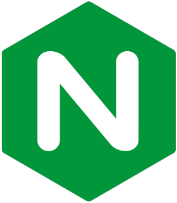
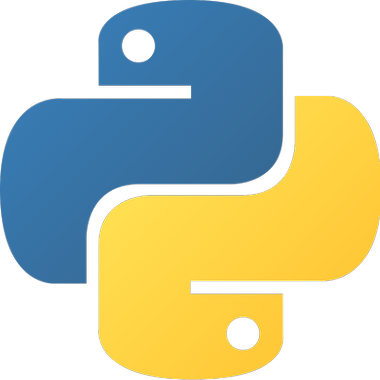

\renewcommand{\contentsname}{Sommaire}
\tableofcontents

# Présentation

## Objectif

- Mettre en place un outil de CI
- Déployer son application sur un serveur
- Se servir d'outils de monitoring 
- Savoir créer des tâches programmées
- Utiliser un nom de domaine (optionnel)

## Cahier des charges

- Utiliser un projet existant ([Projet 8](https://projet-8.ojardias.io))
- Ne pas utiliser de plateforme tel qu'Heroku

## Résultat final

- [https://projet-10.ojardias.io](https://projet-10.ojardias.io)

# Démarche de création

## Mise en place du serveur

{ width=30px } NGINX : un serveur proxy HTTP

{ width=30px } Supervisor : un contrôleur de processus système

{ width=30px } Cron : programmer l’exécution de scripts

{ width=30px } Python3

{ width=30px } Postgresql

## Un workflow complet

{ width=30px } Travis : un service d'intégration continue

{ width=30px } Mergify : un service d'automatisation des pull-requests

{ width=30px } Sentry : un service pour logger les erreurs non gérées

## Points de difficultés

- Plusieurs applications sur un seul serveur
- Mise en place d'un certificat SSL

## Points d'amélioration

- Déploiement automatique sur le serveur
- Commande de mise à jour de la BDD

## Fin

- Merci pour votre attention
