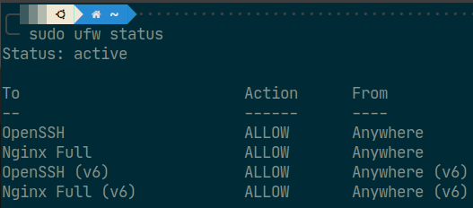
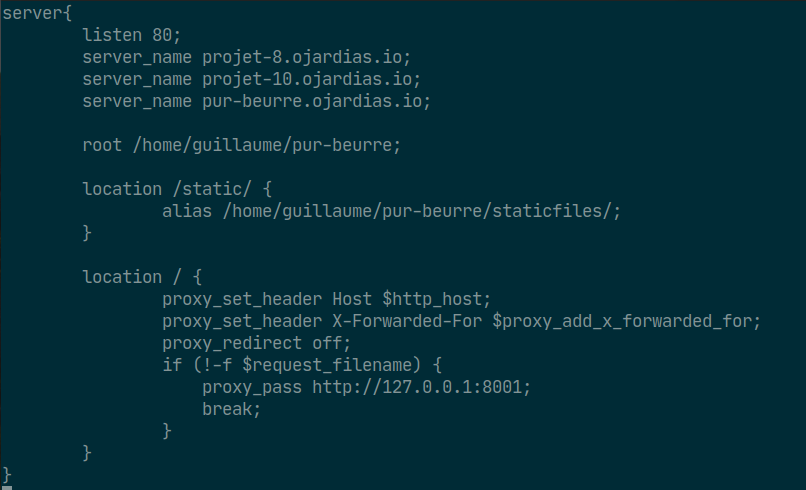
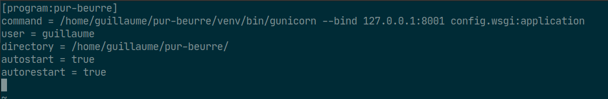
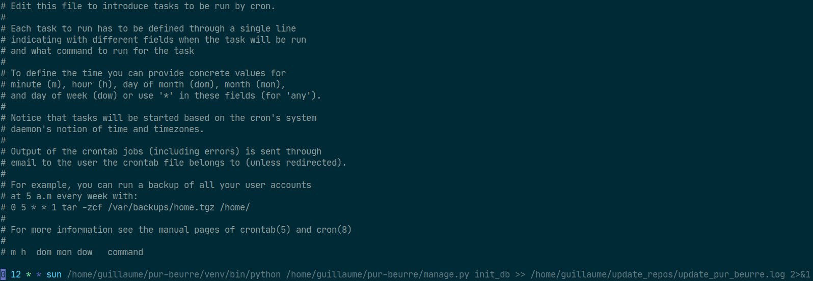
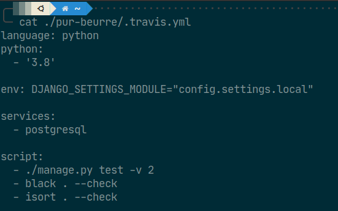
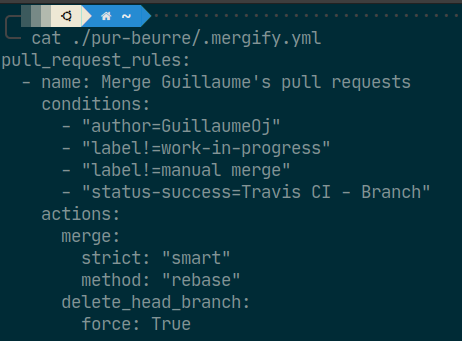
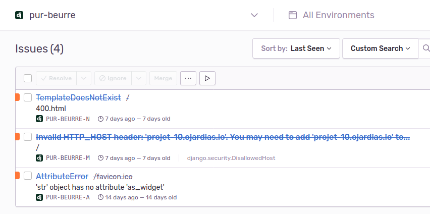
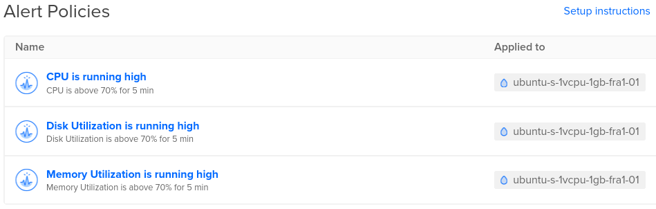

\renewcommand{\contentsname}{Sommaire}
\tableofcontents

\pagebreak
# I. Présentation

Ce projet se base sur le projet 8 : _[Créez une plateforme pour les amateurs de Nutella](https://openclassrooms.com/fr/paths/68/projects/159/assignment)_.

L'objectif principal est de déployer l'application réalisée au projet 8 sur un serveur paramétré par nos soins. Pour cela nous devons mettre en œuvre les éléments suivants :

- un outil d'intégration continue type [Travis](https://travis-ci.com/),
- déployer l'application sur un serveur (ici un serveur proposé par [Digital Ocean](https://www.digitalocean.com/)),
- monitorer les performances de notre serveur,
- logger les erreurs non gérées par notre application avec l'aide de [Sentry](https://sentry.io/welcome/),
- créer un tâche CRON pour mettre à jour la base de données de l'application une fois par semaine,
- et enfin utiliser un nom de domaine (optionnel).

## I.1. Liens du projets

- Le site est visible en ligne à cette adresse : _[https://projet-10.ojardias.io/](https://projet-10.ojardias.io/)_.

# II. Démarche de création

## II.1. Mise en place du serveur

- Création d'un `Droplet` Digital Ocean à l'adresse [http://167.172.169.38](http://167.172.169.38).
- Connexion au serveur en SSH, mise à jour des packages du serveur et création d'un utilisateur `guillaume`.
- Installation de `python3`, `postgresql`, `git`, `nginx` et `supervisor`.
- Clone du [repository GitHub](https://github.com/GuillaumeOj/Pur-Beurre) dans le répertoire `/home/guillaume/pur-beurre`. 
- Paramétrage du pare-feu `UFW`.
- Configuration de NGINX et Supervisor.
- Création de la tâche CRON pour exécuter le script de mise à jour de la base de données (script disponible [ici](https://github.com/GuillaumeOj/Pur-Beurre/blob/master/update_pur_beurre.sh)).

    { width=300px }
    { height=300px }
    { width=300px }
    { width=300px }

\pagebreak
## II.2. Mise en place du CI

- Configuration de Travis pour exécuter nos tests avant de merger dans la branche master de notre repository :
- Mise en place et configuration de Mergify pour automatiser le merge des pull-requests :

    { width=300px }
    { width=300px }

## II.3. Monitoring de l'application

- Configuration de Sentry pour logger les erreurs non gérées par l'application :
- Mise en place d'un monitoring du serveur en utilisant les outils mis à disposition par Digital Ocean :

    { width=300px }
    { width=300px }

\pagebreak
# III. Bilan

## III.1. NGINX et Supervisor

La combinaison de ces deux outils permet de mettre en place très rapidement avec une configuration simple un serveur d'application fonctionnel.
Cependant, j'ai dû faire face à deux difficultés pour leur configuration.

Je souhaitais héberger d'autres applications sur ce serveur, notamment mon [CV en  ligne](https://guillaume.ojardias.io). Après quelques tâtonnements et essais infructueux, j'ai fini par comprendre qu'avec le comportement par défaut de `gunicorn` les applications utilisaient toutes le port 8000. Ainsi, pour chaque application, je fais attention à utiliser un port différent (8000, 8001, 8002, etc.)

Ensuite, je tenais à mettre en place des certificats SSL. Pour cela, j'ai dû modifier les `Nameservers` de mon fournisseur de nom de domaine vers ceux de Digital Ocean, puis avec l'aide de `certbot` j'ai pu créer mes certificats et mettre à jour la configuration de mes serveurs `Nginx`.

## III.2. Travis

L'utilisation de Travis sur ce projet, m'a permis de découvrir un nouvel outil de `Continuous Integration`. En effet, dans le stage que je suis en train de faire, nous utilisons `CircleCi` qui est très similaire.

La configuration par fichier `yml` se fait très aisément et ne présente pas de difficultés particulières pour une utilisation basique comme j'ai pu le faire ici.

## III.3. Sentry et Monitoring

Le monitoring d'une application et de son serveur sont des choses essentiels au bon fonctionnement de celle-ci.

Ainsi la mise en place de `Sentry` m'a permis de mettre en avant une erreur non gérée par mon application. Les templates utilisés pour les erreurs `4xx` et `5xx` ne se chargeaient pas correctement et faisaient planter le serveur d'application. J'ai pu ainsi apporter un correctif et afficher correctement les pages d'erreurs aux visiteurs.

## III.4. Mergify

Je me suis permis d'ajouter un outil sur ce projet qui est `Mergify`.

Cet outil permet, entre autre, de merger automatiquement les pull-requests en fonctions de certaines conditions établies par l'utilisateur.

Ainsi, dans le cadre de ce projet, la pull-request est mergée dans la branche master une fois que les build Travis ont le statut `success` et à condition que j'en sois l'auteur. A l'issu de ce merge, la branche crée pour la pull-request est supprimée.

## III.5 Conclusion

Je suis très content des sujets que j'ai pu aborder au cours de ce projet. C'est en quelque sorte la "dernière" brique d'un projet permettant de gérer une application de sa conception à sa mise en production en passant par sa réalisation.

La dernière chose que j'aimerais faire pour améliorer le workflow  de mon projet, consiste à mettre en place un outil permettant de déployer automatiquement mon applications lorsque la branche master du repository GitHub est mise à jour. Permettant ainsi un déploiement continue.
